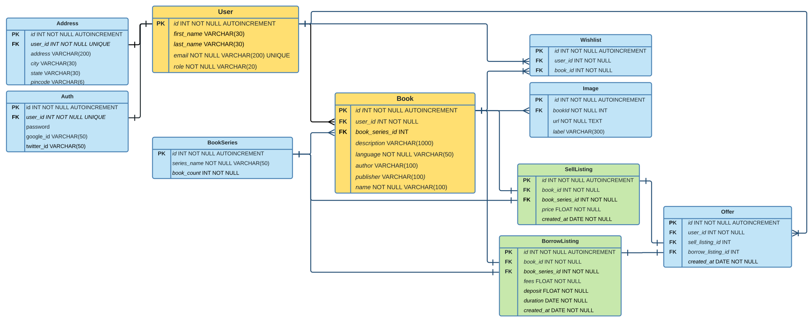

# Server
[](https://github.com/morya-111/server/actions/workflows/CI.yml)
[](https://codecov.io/gh/morya-111/server)

# API Reference

- **GET** `localhost:4000/books/` - Get All Books

    Use this [link](https://github.com/rjlopezdev/typeorm-express-query-builder#available-lookups) for all the filtering and pagination that can be done on this route.

- **POST** `localhost:4000/books/newBook` - Post A new Book

### Auth Routes

- **POST** `/v1/user/register` - Register a user
    
    Request Body
    ```ts
    {
        first_name : string;
        last_name : string;
        email : string;
        password : string;
        address?: string;
        city?: string;
        state?: string;
        pincode?: string;
    }
    ```
    Response Codes
    - `400` - Validation Error
    - `409` - Email / User already exists
    - `200` - User created successfully 

- **POST** `/v1/user/login` - Login a user 

    Request Body
    ```ts
    {
        email : string;
        password : string
    }
    ```
    Response Codes
    - `400` - Email and password is required
    - `403` - Email is associated with social login
    - `401` - Incorrect email or password
    - `200` - User logged in successfully 

- **POST** `/v1/user/logout` - Logout the current user

- **GET** `/v1/user/isloggedin` - Checks if the current user is logged in

    - `401` - You are not logged in / User does not exist / You don't have permission to access this resource.
    - `200` - User logged in. User data returned
  
- **GET** `/v1/auth/google` - Login with google

- **GET** `/v1/auth/facebook` - Login with facebook

---
## Developer Notes
- `protected` - protected is a thunk function which returns a protected middleware. This is used to protect routes and give access to logged in users and users with specified roles.
    
    Arguments
    ```
    roles?: ["INDIVIDUAL" , "SHOP_OWNER" , "ADMIN"] 
    ```
    Response Codes
    `401` - Not Logged In , User does not exist , Doesn't have permission

    Example:-
    ```ts
    // Only looks if user is logged in
    app.get("/v1/loginprotected", protect(), (_, res) => {
	    res.status(200).json({ status: "success" });
    });

    // Looks if user is logged in and has specified roles in this case "ADMIN"
    app.get("/v1/roleprotected", protect(["ADMIN"]), (_, res) => {
	    res.status(200).json({ status: "success" });
    });
    ```
- OAuth Client redirect url and path
  > Set `FRONTEND_CLIENT` env variable to frontend clients host url
  > 
  > Set `SUCCESS_ROUTE` env variable to path to which the user should be redirected on OAuth success.
  >
  > Set `FAILURE_ROUTE` env variable to path to which user should be redirected on OAuth failure.


